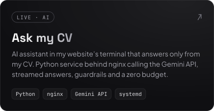
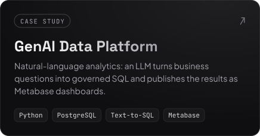
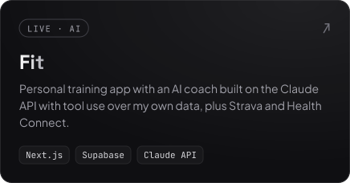
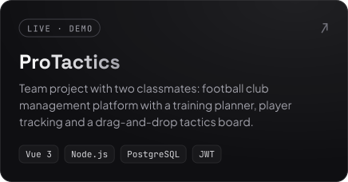
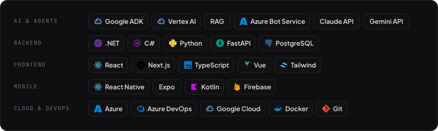

  
  
  

I build **AI agents** that answer from company knowledge (Google ADK, Vertex AI, RAG), the **Python and .NET APIs** behind them, and **React / React Native** apps on top. Software Engineer at **Plain Concepts**, Barcelona.

### Ask my CV

My website has an AI assistant in its terminal. Ask it anything about me at **[alanteixido.dev](https://alanteixido.dev/#ask)**:

### Featured

 
 

### Stack

### Now

- **Building** AI agents on Vertex AI at Plain Concepts
- **Learning** what makes them reliable at scale: evaluation, observability and guardrails
- **Off the keyboard** sports, with the same competitive streak
