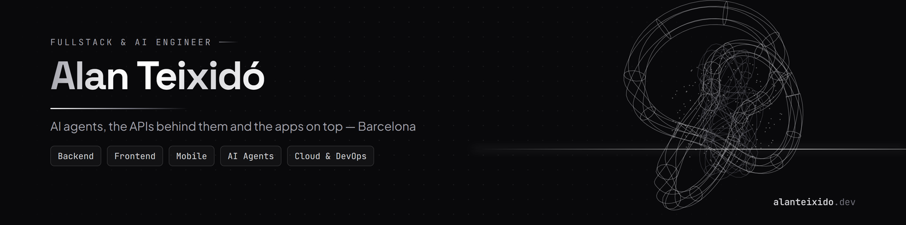

### Fullstack & AI engineer in Barcelona

I build AI agents that answer from company knowledge (Google ADK, Vertex AI, RAG), the Python and .NET APIs behind them, and React / React Native apps on top. Software Engineer at **Plain Concepts**.

**Ask my CV:** my website has an AI assistant in its terminal. Open [alanteixido.dev](https://alanteixido.dev) and type `ask what has Alan built with RAG?`

#### Featured

- **[Ask my CV](https://alanteixido.dev/projects.html#ask-my-cv)** — AI assistant in my site's terminal, answering only from my CV. Python service behind nginx calling the Gemini API, streamed answers, guardrails and rate limits on a zero budget. [Code](https://github.com/AlanTeixido/cvAlanTeixido/tree/main/api)
- **[GenAI Data Platform](https://alanteixido.dev/projects.html#genai-data-platform)** — Natural-language analytics: an LLM turns business questions into governed SQL and publishes the results as Metabase dashboards. Case study.
- **[Fit](https://fit.alanteixido.dev)** — Personal training app with an AI coach built on the Claude API with tool use over my own data. Next.js, Supabase.
- **[ProTactics](https://github.com/AlanTeixido/ProTactics)** — Football club management platform with an interactive tactics board. Vue 3, Node.js, PostgreSQL. [API](https://github.com/AlanTeixido/ProTactics-API)

#### Stack

**AI** Google ADK · Vertex AI · RAG · Azure Bot Service · Claude and Gemini APIs 
**Backend** .NET (C#) · Python · FastAPI · Clean Architecture · CQRS 
**Frontend** React · Next.js · TypeScript · Vue 
**Mobile** React Native · Expo · Kotlin · Firebase 
**Cloud** Azure · Azure DevOps · Google Cloud · Docker

#### Contact

[alanteixido.dev](https://alanteixido.dev) · [LinkedIn](https://www.linkedin.com/in/alanteixidosararols) · [teixido.alan@gmail.com](mailto:teixido.alan@gmail.com)
